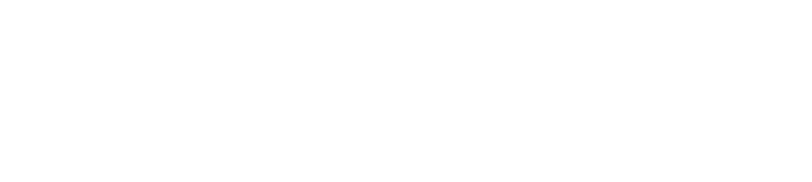

<picture>
  <source media="(prefers-color-scheme: dark)" srcset="images/banner-darkmode.svg">
  <source media="(prefers-color-scheme: light)" srcset="images/banner-lightmode.svg">
  
</picture>

I am currently a computer science student at University of Trunojoyo Madura, with an interest in web development and artificial intelligence.

###

<h2 align="left">Let's connect!</h2>

###

  
  
  

###

<picture>
  <source media="(prefers-color-scheme: dark)" srcset="https://raw.githubusercontent.com/edi-mj/edi-mj/output/pacman-contribution-graph-dark.svg">
  <source media="(prefers-color-scheme: light)" srcset="https://raw.githubusercontent.com/edi-mj/edi-mj/output/pacman-contribution-graph.svg">
  
</picture>

###

  

###
